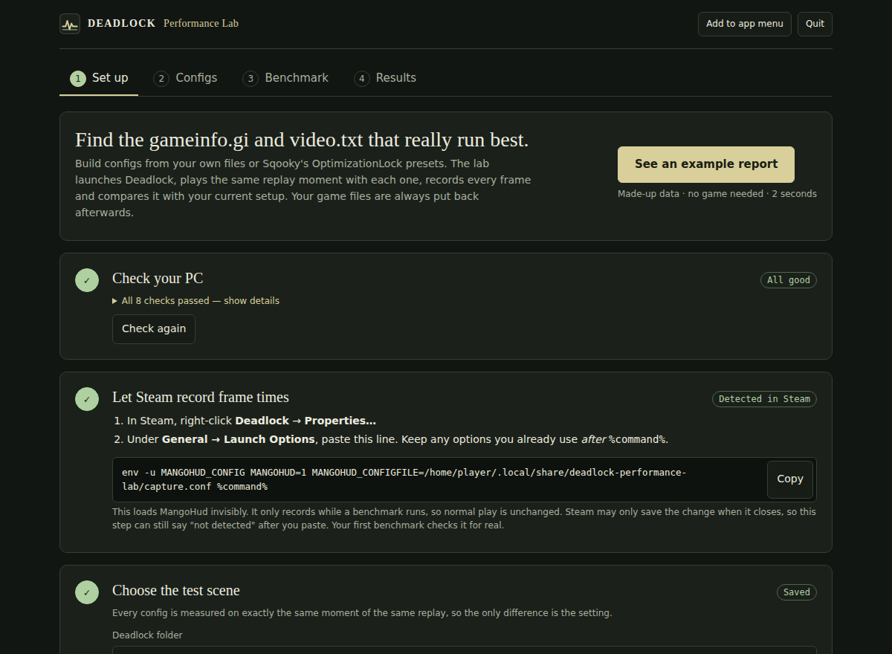

<div align="center">

# DPL - Deadlock Performance Lab

**Find out what actually changes your FPS in Deadlock on Linux.**

[](https://github.com/itchyfeetleech/Deadlock-Performance-Lab/actions/workflows/ci.yml)
[](https://www.python.org/downloads/)
[](docs/QUICKSTART.md)
[](LICENSE)

[Community results](https://itchyfeetleech.github.io/Deadlock-Performance-Lab/) · [Numeric value sweep](https://itchyfeetleech.github.io/Deadlock-Performance-Lab/particle-values.html) · [First benchmark guide](docs/QUICKSTART.md) · [Troubleshooting](docs/TROUBLESHOOTING.md)

</div>

Build `gameinfo.gi` and `video.txt` configs from your own files, from [Sqooky's OptimizationLock](https://github.com/Sqooky/OptimizationLock) presets (fetched from GitHub, never bundled) or from a file you import. Tick and slide individual settings, grouped into categories with descriptions. Then press start: the lab launches Deadlock and plays the same replay moment with each config. MangoHud records every frame, and the report shows your current setup next to each config, with slow frames and how sure the result is. Your game files are put back after every capture.



## Install and open

You need Linux and Python 3.11 or newer (already on most distributions).

```bash
pipx install git+https://github.com/itchyfeetleech/Deadlock-Performance-Lab.git
dpl
```

`dpl` opens the app in your browser. Click **See an example report** to see what you'll get: it uses made-up data and doesn't need the game. **Add to app menu** puts a launcher in your desktop's application menu, so you don't need the terminal again.

<details>
<summary>No <code>pipx</code>? Other ways to install</summary>

- Install pipx first: `sudo apt install pipx` (Debian/Ubuntu), `sudo pacman -S python-pipx` (Arch) or `sudo dnf install pipx` (Fedora). Then run `pipx ensurepath` and open a new terminal.
- With [uv](https://docs.astral.sh/uv/): `uv tool install git+https://github.com/itchyfeetleech/Deadlock-Performance-Lab.git`
- Without installing anything: download `dpl.pyz` from the [latest release](https://github.com/itchyfeetleech/Deadlock-Performance-Lab/releases/latest) and run `python3 dpl.pyz`. Releases from 0.3.0 onward include it.

To update, run `pipx upgrade deadlock-perf-lab`, or `pipx install --force` with the command above.
</details>

## Your first benchmark

The app walks you through four tabs:

1. **Set up.** It checks for Steam, MangoHud and Deadlock, and gives you one line to paste into Deadlock's *Launch Options* in Steam. Then you pick a replay and the moment to measure. Your resolution, display mode and Proton version are filled in for you.
2. **Configs.** Start from your current file, an OptimizationLock preset or an imported file, and tick the settings to change. Preview the exact file changes and save. [More about configs](docs/CONFIGS.md).
3. **Benchmark.** Tick the configs to compare and choose **Quick look**, **Shortlist** or **Confirm**. Set the FPS limit (uncapped by default) and graphics API, which apply to every capture. Press **Start**; the app tells you in advance how many times Deadlock will launch and roughly how long it will take.
4. **Results.** Open the report, confirm the captures you watched, and download a ZIP to share. Download a winning config's files from the Configs tab to install them.


For real benchmarks you need native (non-Flatpak) Steam, Deadlock, [MangoHud](https://github.com/flightlessmango/MangoHud#installation) and a downloaded match replay. The [first benchmark guide](docs/QUICKSTART.md) has details and tips on picking a good scene.

## What it does to your system

- **Your setup is the baseline.** Each round measures it before and after the configs you picked, so drift from heat or background load shows up.
- **Changes are temporary.** Each capture writes the config's `gameinfo.gi` and `video.txt` (and a small temporary `autoexec_dpl.cfg`), then launches the game, measures and restores your files. A crash-safe journal backs up the files first. If a power cut interrupts a run, the app shows **Restore my files** (or run `dpl recover`).
- **It never touches Steam settings, drivers or a game you started yourself.** Benchmarks only play local replays (or a bot match), launched with `-insecure`, which turns VAC off for that launch.
- **Everything stays on your machine.** The app only listens on `127.0.0.1`. It contacts GitHub only when you pick an OptimizationLock preset. Shared ZIPs contain the report only, not raw logs, game files or replay paths.

An **improved** or **regressed** verdict needs the **Confirm** length (five rounds), stable baselines, and your confirmation that the captures looked right. Shorter runs give you numbers but no verdict. Read [how results are measured](docs/METHODOLOGY.md).

## Command line

Everything in the app is also available as a command, for scripting or remote use:

| Command | What it does |
|---|---|
| `dpl` | Open the app (`dpl gui --no-browser` prints the address instead) |
| `dpl demo --open` | Build and open the example report |
| `dpl doctor` | Check Steam, MangoHud, the game and pending restores |
| `dpl setup` | Print the Steam launch options line |
| `dpl profile add my-config --gameinfo FILE --video FILE` | Save your own files as a config |
| `dpl plan --cases my-config --preset confirm --fps-max 0` → `dpl run --live` | Plan and run a benchmark |
| `dpl report --open` · `dpl export --output report.zip` | Open or share the latest report |
| `dpl recover` | Put game files back after an interrupted run |
| `dpl guide` · `dpl --help` | The terminal workflow and every command |

Settings and results live in `~/.local/share/deadlock-performance-lab`. Use `--workspace PATH` or `DPL_WORKSPACE` to change this. An existing `./.lab` folder from earlier versions is still used when you run `dpl` from its directory.

More guides:

- [Custom gameinfo.gi and video.txt configs](docs/CONFIGS.md)
- [Screening many single-cvar values](docs/OPTIMIZATION.md)
- [Test Proton, driver or OS settings you change by hand](docs/MANUAL_EXPERIMENTS.md)
- [How results are measured](docs/METHODOLOGY.md) · [Troubleshooting](docs/TROUBLESHOOTING.md)

<details>
<summary>Example report (synthetic data)</summary>


</details>

## Repository layout

| Path | Contents |
|---|---|
| [`src/deadlock_perf_lab`](src/deadlock_perf_lab) | The `dpl` app and command line (standard library only) |
| [`docs`](docs) | User guides, methodology and architecture |
| [`examples`](examples) | Sample workspace settings, a console-cvar file and a sweep matrix |
| [`research`](research) | Scripts and inputs behind the published community experiments |
| [`site`](site) | The community results website (GitHub Pages) |
| [`tests`](tests) | Automated tests; no game or Steam needed |

## Contributing

See [CONTRIBUTING.md](CONTRIBUTING.md) for development setup and how to report bugs.

[GPL-3.0-only](LICENSE). Presets come from [Sqooky/OptimizationLock](https://github.com/Sqooky/OptimizationLock) (GPL-3.0) at your request; credits are in [THIRD_PARTY_NOTICES.md](THIRD_PARTY_NOTICES.md). Independent community project, not affiliated with Valve.
