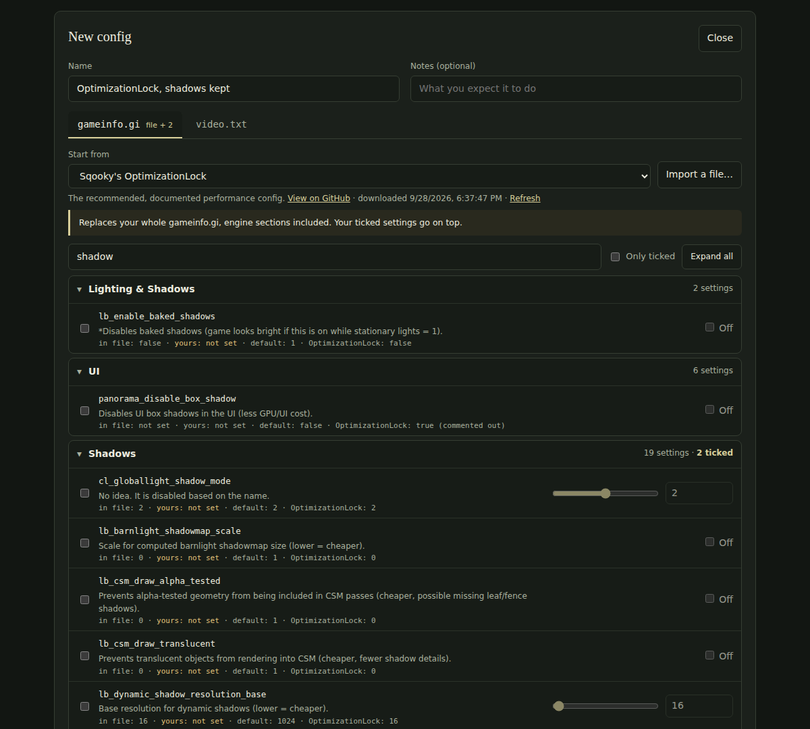
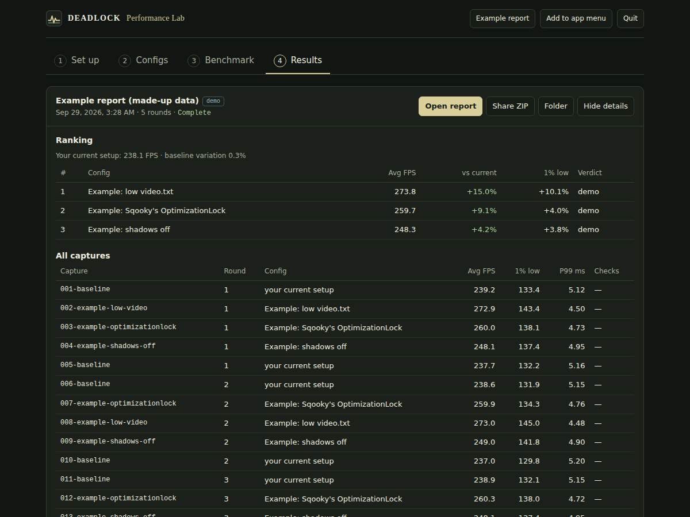
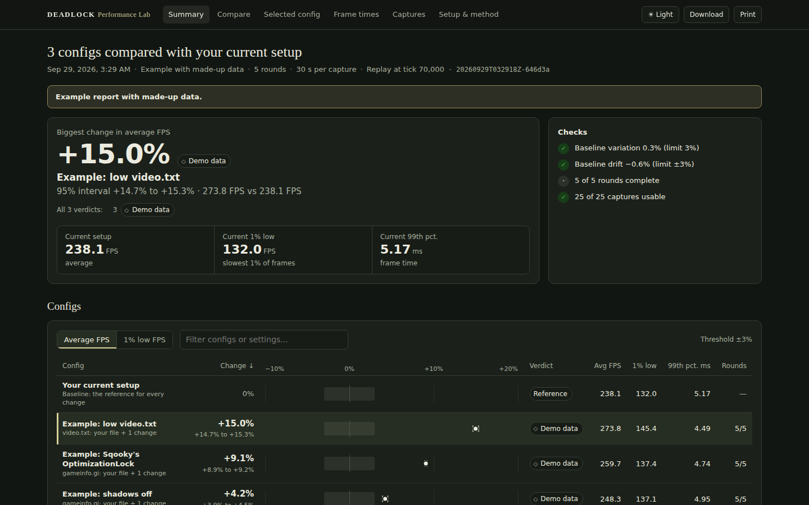

<div align="center">


# DPL · Deadlock Performance Lab

Benchmark `gameinfo.gi` and `video.txt` changes in Deadlock on Linux.

[](https://github.com/itchyfeetleech/Deadlock-Performance-Lab/actions/workflows/ci.yml)
[](https://www.python.org/downloads/)
[](LICENSE)



</div>

DPL launches Deadlock, plays the same replay moment for each config, records every frame with MangoHud and compares each config with your current setup.

## Install

Needs Linux and Python 3.11 or newer.

```bash
pipx install git+https://github.com/itchyfeetleech/Deadlock-Performance-Lab.git
dpl
```

`dpl` opens the app in your browser.

<details>
<summary>Without pipx, or to update</summary>

- Install pipx: `sudo apt install pipx` (Debian/Ubuntu), `sudo pacman -S python-pipx` (Arch) or `sudo dnf install pipx` (Fedora), then `pipx ensurepath` and open a new terminal.
- Or use [uv](https://docs.astral.sh/uv/): `uv tool install git+https://github.com/itchyfeetleech/Deadlock-Performance-Lab.git`.
- Or download `dpl.pyz` from the [latest release](https://github.com/itchyfeetleech/Deadlock-Performance-Lab/releases/latest) and run `python3 dpl.pyz`.
- Update with `pipx upgrade deadlock-perf-lab`.

</details>

Benchmarks also need native (non-Flatpak) Steam, Deadlock, [MangoHud](https://github.com/flightlessmango/MangoHud#installation) and a downloaded match replay. The app checks for these.

## Use

1. **Set up:** paste one line into Deadlock's Steam launch options, then pick a replay and the moment to measure.
2. **Configs:** start from your own files, a [Sqooky OptimizationLock](https://github.com/Sqooky/OptimizationLock) preset or an imported file, and tick the settings to change. **Test each setting separately** makes one config per setting.
3. **Benchmark:** tick configs, pick a length and press **Start**.
4. **Results:** a ranking, the full report and a shareable ZIP.



<details>
<summary>The report (example data)</summary>



</details>

To use a config, download its files from the Configs tab and copy them into the game folder. DPL doesn't install configs.

## What it changes on your PC

- `gameinfo.gi`, `video.txt` and a temporary `autoexec` are backed up before each capture and restored after it. After a crash or power cut, **Restore my files** in the app (or `dpl recover`) puts them back.
- Deadlock is launched with `-insecure` (VAC off for that launch) and plays a local replay or a bot match. It never joins online matches.
- The app listens on `127.0.0.1` only and downloads nothing except the presets you pick. Share ZIPs contain the report, not raw logs, game files or replay paths.

## Command line

| Command | What it does |
|---|---|
| `dpl` | Open the app (`dpl gui --no-browser` prints the address instead) |
| `dpl demo --open` | Build and open an example report from made-up data |
| `dpl doctor` · `dpl setup` | Check your PC · print the Steam launch line |
| `dpl profile add NAME --gameinfo FILE --video FILE` | Save your own files as a config |
| `dpl profile sweep tests.csv` | One config per `id,cvar,value` row |
| `dpl plan --cases A,B --preset confirm --fps-max 0` → `dpl run --live` | Plan and run a benchmark |
| `dpl report --open` · `dpl export --output report.zip` | Open or share a report |
| `dpl recover` | Put game files back after an interrupted run |

`dpl --help` lists everything. Settings and results live in `~/.local/share/deadlock-performance-lab` (change with `--workspace` or `DPL_WORKSPACE`).

## Documentation

| | |
|---|---|
| [First benchmark](docs/QUICKSTART.md) | Setup and a first run |
| [Configs](docs/CONFIGS.md) | Presets, settings, `video.txt`, imports, installing a config |
| [Advanced use](docs/ADVANCED.md) | Many settings at once, run lengths, console cvars, manual captures |
| [Methodology](docs/METHODOLOGY.md) | Metrics and verdict rules |
| [Troubleshooting](docs/TROUBLESHOOTING.md) | Common problems and recovery |
| [Changelog](CHANGELOG.md) | Changes per version |

## Contributing

See [CONTRIBUTING](.github/CONTRIBUTING.md) and, for vulnerabilities, [SECURITY](.github/SECURITY.md).

[GPL-3.0-only](LICENSE). Presets come from [Sqooky/OptimizationLock](https://github.com/Sqooky/OptimizationLock) (GPL-3.0) when you pick them; credits are in [THIRD_PARTY_NOTICES](THIRD_PARTY_NOTICES.md). Not affiliated with Valve.
